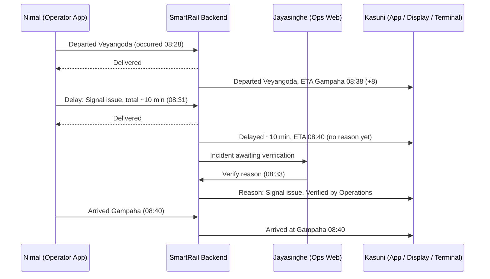
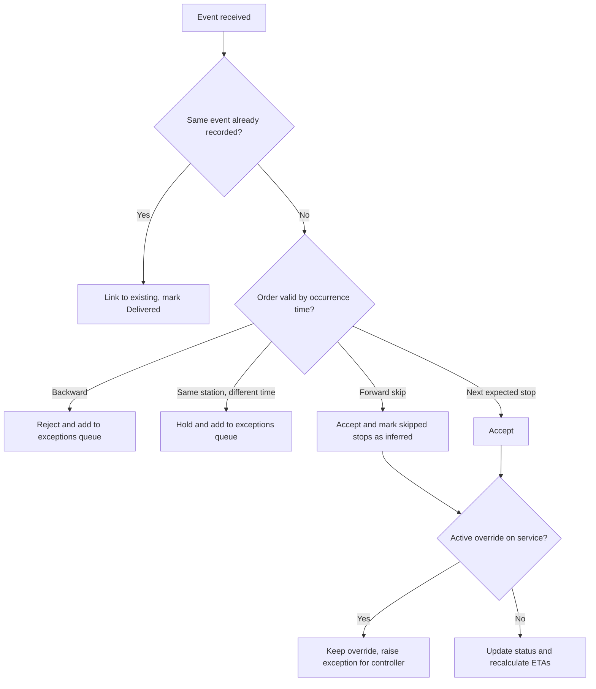
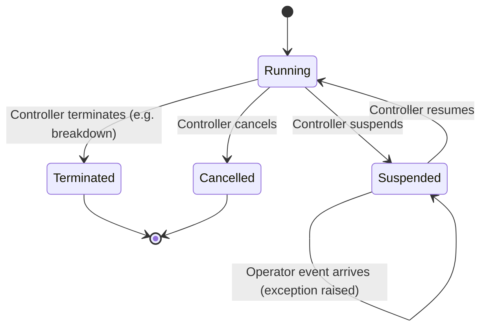
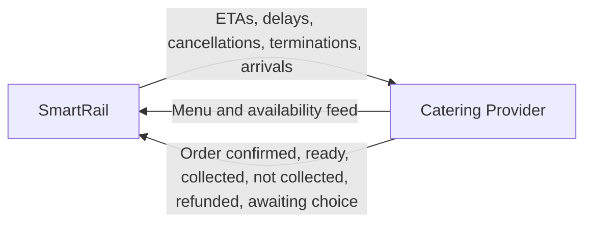
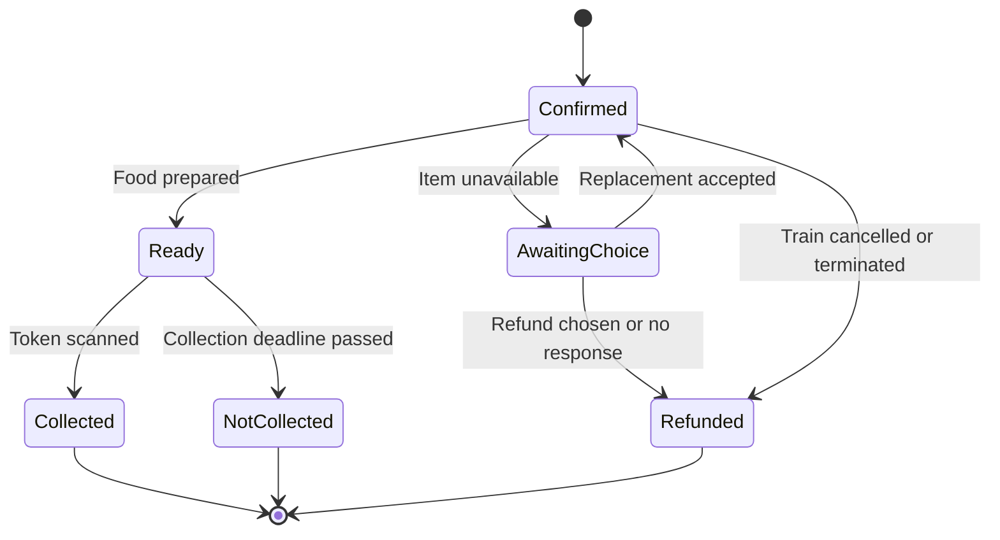

# SmartRail – Requirements Discovery Summary

**Status:** Working document, consolidated from Day 1 discovery (29 Sep 2026); updated with station experience, component scope, epics, MoSCoW, sizing, build order, architecture, UX wireframes, design system, and security review findings (1 Oct 2026)
**Owner:** Tharindu (all decisions below were made or accepted by the owner; items marked *Assumption* or *Open* are not yet confirmed)

> Anchors for every decision: the **problem statement** (section 1) and the **assessment brief**.

---

## 1. Problem Statement

**Version 2 (current)**

> Sri Lanka Railways currently relies on fragmented systems that provide schedules, reservations, and partial train updates, but lacks a single authoritative source of real-time operational data. Consequently, passengers, external service providers, and railway personnel frequently make decisions based on stale, incomplete, or unavailable information. This results in passenger inconvenience, inefficient railway operations, increased operational costs, and food waste due to the inability to accurately coordinate services with actual train movements.

**Version 1 (history – kept to show the discovery progression)**

> Customers can't exactly get to know the time the train will arrive because the existing applications don't provide real-time updates, which leads to unexpected delays and time wasted and negative feedback for the railway.

What changed from v1 to v2: the cause moved from a missing feature ("no real-time updates") to a root cause (no authoritative data source); the affected parties widened beyond passengers; the solution was removed from the statement.

---

## 2. Context and Assumptions

| ID | Assumption |
|----|-----------|
| A-01 | SmartRail is a fictional organisation, modelled on a Sri Lankan-style national network (real lines, stations, and three languages). |
| A-02 | No hardware will be implemented. Phones/tablets running SmartRail apps are the only devices. |
| A-03 | The **Train Operator** is a separate on-train role (guard/conductor-like) from the **Driver**. The operator reports events; the driver is not a SmartRail actor. |
| A-04 | If the operator's app cannot send an event, the operator can phone the operations desk for their line; the controller enters the event on their behalf. |
| A-05 | Safety-critical data (speed restrictions, signalling) and emergency response are **outside** SmartRail. SmartRail informs; railway radio, signalling, and emergency services control train movement and emergencies. |
| A-06 | A **Railway–Caterer Service Agreement** exists and defines refunds, cutoffs, collection deadlines, and compensation. SmartRail does not enforce these policies. |
| A-07 | Thresholds (grace period, notification delay threshold, long-stop dwell of 5+ min) are configurable; initial values are assumptions to be confirmed. |
| A-08 | Planned platforms come from timetable seed data. |
| A-09 | Payments in the prototype are simulated. |
| A-10 | A railway–caterer service agreement defines refunds, cutoffs, and compensation (see A-06). |
| A-11 | An Android emulator with Google Play is an acceptable test device; a real device is used for a final check if one can be borrowed. |
| A-12 | A native Tamil speaker is available to validate translations in week 3. |
| A-13 | Only the catering provider is modelled as an external service provider. |

> The full requirement discovery register, organised by the categories in brief section 22, is in **smartrail-discovery-register.md**.

---

## 3. Existing-Solution Analysis (RDMNS.LK – analogous market research)

RDMNS is a volunteer, passenger-run app in Sri Lanka. It is used here as real-world evidence of the problem, not as SmartRail's existing system.

| Area | Does well | Does poorly | Implication for SmartRail |
|------|-----------|-------------|---------------------------|
| Data source | Community fills the information gap | Data comes from volunteer passengers, not the railway | The railway must be the authoritative source |
| Freshness | Shows "last update" and how long ago; colour legend by age | Many stops show "No information received"; updates can be 30+ min old | Never show silent data; show last verified update |
| Trust | "Thanks for the update" social signal | "Running on schedule" with zero confirmations is ambiguous | Show source and verification ("Verified by Operations") |
| Ecosystem | Links to reservations, e-tickets | Hands off to other organisations' systems via redirects | Evidence of fragmented ownership |
| Language | Sinhala, Tamil, English | — | Three-language requirement (not in the brief) |
| Accessibility | — | Radar status relies heavily on colour | Status must not rely on colour alone |
| Favourites | "My Trains" saved trains | — | Saved journey for commuters |

---

## 4. Actors and MVP Status

| Actor | Type | MVP status | Notes |
|-------|------|-----------|-------|
| Daily commuter (Kasuni) | Primary persona | Implement | Designs are optimised for her when needs conflict |
| Occasional / long-distance passenger | Secondary | Partly served | Via kiosk, displays, catering scenario |
| Passengers with language / accessibility needs | Cross-cutting | Implement | Sinhala, Tamil, English; colour-independent status; text scaling; screen readers |
| Passengers without a smartphone | Secondary | Implement | Station displays and kiosk terminal |
| Train Operator (Nimal) | Persona | Implement | Authoritative MVP event source |
| Operations Controller + Customer Information (Jayasinghe) | Persona | Implement | Merged for MVP; designed to split later |
| Station staff | Internal | Design only | Platform changes handled by controller in MVP |
| Scheduler | Internal | Out of scope | Timetable is seed data |
| System administrator | Internal | Designed | Manages staff accounts and roles through the identity provider's own admin console; no custom admin UI in SmartRail |
| Catering provider | External system | Implement (simulated) | Owns menu, payment, refunds, fulfilment |
| Catering handler | Caterer's staff | Not a SmartRail user | Uses the caterer's system |
| Train driver | — | Not an actor | See A-03 |

### Persona summaries

| | Nimal Perera | Kasuni Fernando | S. Jayasinghe |
|---|---|---|---|
| Role | Train Operator (on-train, not driving) | Accounts executive, daily commuter | Senior Operations Controller, Main Line desk |
| Age / location | — | 29, Gampaha → Colombo Fort | 46, Central Operations Centre, Colombo Fort |
| Language | Sinhala (Tamil/English support) | Sinhala | Sinhala and English |
| Accessibility / environment | Large buttons, minimal typing, outdoor contrast | Mild colour-vision deficiency | Dense data, keyboard workflows, multiple monitors |
| Device / connectivity | Railway-issued Android; intermittent | Mid-range Android; occasional loss | Desktop; reliable wired |
| Why chosen | Creates the data | Relies on the data | Oversees, corrects, communicates |

---

## 5. Core Design Principles

| ID | Principle |
|----|-----------|
| P-01 | **One source of truth, multiple presentation channels.** App, displays, and terminal may present differently but never contradict each other or calculate their own ETAs. |
| P-02 | **Passengers never see silent data.** Stale or missing information is always labelled with its age and last verified event. |
| P-03 | **System acknowledgement for normal events; human review for exceptions.** |
| P-04 | **The app prevents mistakes; the backend enforces rules.** (e.g. next-valid-action UI plus server validation) |
| P-05 | **People report; the system derives.** Operators report facts; the system calculates delay, ETA, journey start/end, and inferred passages. |
| P-06 | **Journey order is judged by occurrence time**, not received time. Received time is kept for auditing. |
| P-07 | **Missed reporting is a data-quality issue, not an operational exception.** |
| P-08 | **The operator should spend as little time as possible interacting with the app.** |
| P-09 | **Status and trust are different kinds of information.** Status (On Time, Delayed, Cancelled) and trust metadata (Verified by Operations, last update) are shown separately and never share icons. |
| P-10 | **One icon, one meaning** across the app, displays, and terminal. |
| P-11 | **Words are expensive.** On public displays, use words only where meaning would be ambiguous without them; prefer times, numbers, and icons. |
| P-12 | **Each display answers one question.** Main board: "Where do I need to go?" Platform display: "Should I keep waiting?" |
| P-13 | **Immediate attention, then navigation, then discovery** (screen content order). |
| P-14 | **The most important message is always the largest thing on the screen.** |
| P-15 | **Exceptions are only situations that need intervention.** Every exception type traces to a rule that creates it. |

---

## 6. Live Data Design

### 6.1 Event sources

| Source | MVP |
|--------|-----|
| Operator reports in app (Option A) | Implement |
| Controller entry / override (Option D) | Implement |
| Simulator (Option E) – for demo and testing | Implement |
| Automatic GPS from operator's phone (Option B) | Design only |
| Station staff confirmations (Option C) | Design only |
| Volunteer / crowd reports | Rejected as an authoritative source (problem statement) |

### 6.2 Train movement event (conceptual)

Each event records: train/journey, event type, station, **occurrence time** (device), **received time** (server), **source** (operator / controller entry / simulator / inferred), and reporter.

### 6.3 What the operator reports vs what the system derives

| Operator reports | System derives |
|------------------|----------------|
| Departure at every stop | Journey started (= departure from origin) |
| Arrival at designated stations only (major interchanges, food collection stations, final destination) | Journey completed (= arrival at final station) |
| Delay/incident: reason from list (or "Other" free text) + estimated **total** delay (+10/+15/+20…/Unknown) | Delay minutes, ETAs, passed stops (inferred) |

"Arrival required" is a property of the stop, stored in station/journey data.

### 6.4 ETA engine (MVP)

`ETA at each remaining stop = scheduled time + current delay`

- Current delay = occurrence time of the latest event − its scheduled time, **or** the operator's estimated total delay if more recent.
- Operator estimates are **total delay from the timetable**, not additional minutes.
- Only estimate options greater than the current delay are offered.
- No machine learning or prediction models in the MVP.

### 6.5 Confidence and staleness

- Confidence is based on whether the **next expected event is overdue** (timetable + current delay + grace period), not on raw time since the last update. (Replaced an AI-suggested age-based table.)
- Two kinds of silence are handled separately:
  - **The train is quiet** (no events): "Waiting for update. Last seen: departed Veyangoda 08:28."
  - **The screen is offline** (device lost connection): "You're offline. Showing information from [time]."
- Passenger wording is plain language ("Arrival time may change", "Last verified 2 minutes ago"), never "Confidence: Low".

---

## 7. Core Journey: Train 8058 Delayed Between Veyangoda and Gampaha

**Timetable (Main Line, towards Colombo):** Veyangoda dep 08:20 → Gampaha arr 08:30 (designated arrival station) → Ragama → Colombo Fort.

> Note: reporting times in this timeline were adjusted so that every number is consistent with the "total delay" rule. Verify before using as test data.

### 7.1 Main flow

| Time | Nimal (Operator) | SmartRail backend | Jayasinghe (Controller) | Kasuni (Gampaha, app and platform display) |
|------|------------------|-------------------|--------------------------|---------------------------------------------|
| 08:28 | Taps "Departed Veyangoda" | Records event; delay +8; Gampaha ETA 08:38; acknowledges delivery | No action (normal event) | "Departed Veyangoda 08:28 · Expected 08:38 (+8 min)" |
| 08:31 | Held at signal. Reports delay: *Signal issue*, total ~10 min | Gampaha ETA 08:40; reason held for review; incident added to exceptions queue | Sees incident in queue | "Delayed (~10 min) · ETA 08:40" (no reason yet) |
| 08:33 | — | Publishes verified reason | Verifies reason | "Reason: Signal issue · Verified by Operations" |
| 08:40 | Taps "Arrived Gampaha" | Records arrival | — | "Arrived at Gampaha 08:40" |

**Kasuni's decision:** she sees the delay before reaching the platform, decides to wait, and does not call a taxi. *The value is not that the train is punctual; it is that the information is trustworthy.*

The terminal shows the same data as the display (P-01). It may highlight the delay, but never calculates its own ETA.



### 7.2 Alternative flows

| ID | Situation | Behaviour |
|----|-----------|-----------|
| AF-1 | Operator offline | Event stored on device with occurrence time; "Not sent yet – will send automatically"; auto-sent later; status → Delivered |
| AF-2 | Report rejected (conflict) | Status "Rejected – requires Operations review"; goes to exceptions queue |
| AF-3 | No report arrives (Gampaha expected 08:40, nothing by end of grace period, e.g. 08:45) | Passengers: "Waiting for update. Last seen: departed Veyangoda 08:28"; Controller: "overdue report" exception; no push notification |
| AF-4 | Phone fallback | App shows the correct number for the train's line (e.g. Main Line desk); controller enters event with source "Controller entry, reported by operator by phone"; later operator sync is linked, not duplicated |
| AF-5 | Estimate "Unknown" | Passengers: "Train delayed. Delay duration currently unknown." |
| AF-6 | Reason "Other" (free text) | Free text visible to controller only; never published; controller picks a published reason |

---

## 8. Event Validation Rules

| Rule | Behaviour |
|------|-----------|
| Duplicate (same event received again – taps, retries, sync, phone + app) | Recorded once; operator sees Delivered; no error |
| Same station, different time | Not applied automatically; exceptions queue; operator told it awaits review |
| Forward skip (Ragama reported, Gampaha missing) | Accepted; Gampaha recorded "passed – inferred (operator confirmation missing)" in history; no exception; passengers see normal progress |
| Backward conflict (by **occurrence** time) | Rejected; exceptions queue |
| Late-arriving event in correct occurrence order | Accepted; received time kept for audit |
| Next valid action only | Completed actions disappear; next station action shown; "Report Delay" always available |



---

## 9. Overrides and Disruptions

### 9.1 ADR-05: Overrides remain until explicitly cleared

Operational overrides (Suspended, Cancelled, Terminated, Station Closed, Section Closed) remain active until an Operations Controller clears them. Later operator events do not remove an override; they raise an exception for the controller. Passengers keep seeing the override state (e.g. "Service Suspended") and never see internal uncertainty.

*Train movement events update position and timing. Controller overrides update service state.*



Overrides are designed to target a **train, a station, or a line section**, so section and station closures can be added without redesign.

### 9.2 Disruption types

| Disruption | Handling | Priority |
|------------|----------|----------|
| Delay | Operator delay report + verification | Must |
| Breakdown | "Technical fault" reason, Unknown estimate; "Terminated at [station]" override if it can't continue | Must |
| Cancellation / suspension | Controller override | Must |
| Platform change | Controller changes platform; all channels update; subscribed passengers notified | Should |
| Landslide / flood (line section) | Reports from field or ops centre → exceptions queue (top severity) → controller accepts → section closed; all trains through it affected automatically | Should |
| Station closure | Override targeting a station | **Open** |

Delay reason list includes at least: Signal issue, Technical fault, Obstruction, Weather / natural hazard, Other.

---

## 10. Catering and Food Ordering

### 10.1 Ownership boundary

| Catering provider owns | SmartRail owns |
|------------------------|----------------|
| Menu, prices, availability | Accurate, timely train data |
| Payment (taken at ordering) and refunds | Delivering train events to the caterer reliably |
| Food preparation and handover | Displaying order status to the passenger |
| Collection handlers (caterer's employees) | Offering eligible collection stations |

**Why the caterer takes payment (option B):** reduced complexity, SmartRail never handles payment data (smaller security scope), and a clear accountability boundary, consistent with brief section 12.

### 10.2 Business rules

| Situation | Rule |
|-----------|------|
| Ordering window | Until the station-specific preparation cutoff, **fixed to the timetable**, set by the caterer |
| Change / cancel | Until the cutoff |
| Train delayed but reaches station | Order continues; preparation follows live ETA |
| Train cancelled or terminated before collection station | Automatic **full refund** per service agreement; alternatives only with passenger consent |
| Item unavailable after ordering | Caterer offers replacement or refund; no response by deadline → full refund |
| Passenger misses collection | Marked Not Collected; no automatic refund (responsibility passes to passenger once the train arrives and food is ready) |

### 10.3 Collection

- **Eligible stations:** the passenger's destination, or approved stations with a scheduled long stop (5+ min) and catering facilities. No collection at normal 1–2 min stops.
- **Fixed collection point** on the platform (e.g. "Food Pickup Counter A").
- **One-time token** (QR + code, e.g. GPH-4827), stored on the passenger's device when the order is confirmed so it works offline.
- The handler only needs the token and items, not the passenger's name or phone (data minimisation).

### 10.4 Integration events



### 10.5 Order status as seen by Kasuni



---

## 11. Station Experience

### 11.1 Display types (one web application, different modes)

| | Main station board (entrance) | Platform display |
|---|---|---|
| Question it answers | Where do I need to go? | Should I keep waiting? |
| Content | Upcoming trains, destinations, platforms, status, short service alerts | One train: number, destination, ETA, status, delay, last update, verification |
| Offline behaviour | Keeps showing last known / scheduled information, clearly labelled as not live, with last synchronised time | Keeps showing last known information, labelled "Live updates unavailable", with last verified time |

Displays never freeze while looking current (P-02).

### 11.2 Platform display example (Platform 2, Gampaha)

```
Platform 2
8058   Colombo Fort   [Sinhala] [Tamil] [English]
08:40
[Delayed icon] +10 min   Delayed [three languages]
[Shield icon] 08:31
```

### 11.3 Languages on public displays

- Sinhala, Tamil, and English shown **side by side**, not rotating, so critical information is never hidden by the language cycle.
- Destinations, statuses, and any remaining labels appear in all three languages; times, platform numbers, train numbers, and icons are language-neutral.

### 11.4 Icons and accessibility

- Status is shown with text and icon, never colour alone (Kasuni's colour-vision need applies to displays too).
- Verification uses a dedicated shield-style badge, never a status icon.
- Icons are chosen for their meaning to passengers in a station (e.g. avoid "no entry" style symbols for "offline") and must be usability-tested.
- A consistent icon library is used, not emoji.
- Large, high-contrast text readable across a platform.

### 11.5 Announcements

- **Should:** announcement text generated from the same event stream as the displays.
- **Design only:** audio playback, text-to-speech, PA hardware.

### 11.6 Station terminal (Could)

Purpose: *"I don't have the SmartRail app. How do I find my train?"*

1. Search destination
2. Journey results: next train, platform, ETA, status
3. Train details: stops, last verified update, verified reason

Terminal-specific requirements (single user at a time): language chosen per user; reset after inactivity; reachable touch targets and arm's-length readability. The terminal never calculates its own ETA (P-01).

---

## 12. Component Scope

| Component | Priority | Reason |
|-----------|----------|--------|
| Backend + event processing + ETA engine | Must | Core platform capability |
| Operations web app | Must | Required to manage and verify operations |
| Train operator app | Must | Primary source of live events in the MVP |
| Passenger mobile app | Must | Primary passenger experience |
| Simulator | Must | Enables demos, testing, and live-train scenarios |
| Simulated catering integration | Must | Explicitly required by the brief |
| Station displays (main board + platform modes) | Must | Satisfies the required Station Experience deliverable and shows the live information flow |
| Station terminal | Could | Valuable, but largely reuses passenger functionality |

**Fallback if behind schedule:** cut the terminal first. Displays alone satisfy brief section 23.

---

## 13. POV Statements and HMW Questions

Traceability chain: **Problem statement → Persona → POV → HMW → Epic → Story**

| Persona | POV | Key HMWs |
|---------|-----|----------|
| Kasuni | Needs to decide whether to wait, change plans, or continue her journey, because the value of railway information is not that the train is on time, but that the information is trustworthy enough to act on. | Help passengers make confident decisions even when trains are delayed · Make it obvious when information is current, verified, or outdated · Keep information consistent across app, displays, and terminal |
| Nimal | Needs to report operational events with minimal effort, because his primary job is running the service safely, not updating systems. *(Insight is a hypothesis.)* | Capture reliable live information without distracting operators · Let operators report disruptions quickly with minimal typing · Make sure operators know whether reports reached Operations |
| Jayasinghe | Needs to quickly identify, verify, and communicate significant operational issues, because passengers lose trust when information is inconsistent, delayed, or incorrect. | Help controllers focus on genuine issues · Publish verified information quickly without publishing unverified explanations · Maintain one trusted view of the network during disruptions |

Full POV/HMW write-ups are kept separately (drafted with Microsoft Copilot; see AI usage log).

---

## 14. Epics and Thin Slices

| Epic | Scope (thin slice) | Size | Days |
|------|--------------------|------|------|
| E01 Identity & Access | Identity provider with seeded operators/controllers/roles (realm import); sign-in for operator and operations apps; role checks in API; assigned-journey rule; system-to-system auth for caterer | M (risk) | 1 |
| E02 Reference Data & Simulator | Seed data (one line); replay engine using the operator API; scenarios as data (delay, silence, delayed delivery, incident); controllable clock (ADR-06) | L | 3 (≈2 after skeleton) |
| E03 Train Operator Reporting | Journey view with next valid action; departure, designated arrival, delay (reason list, total estimate, Unknown); offline queue; delivery status | L | 2 |
| E04 Live Status & ETA | Event ingestion (with source attribution); validation rules; ETA engine; overdue detection + freshness; verification state and staged publishing | L | 3 |
| E05 Operations Control | Active trains list; single prioritised exceptions list; verify and publish; enter event on operator's behalf; one generic service-state override (Suspend/Cancel/Terminate); disruption message | L | 3.5 |
| E06 Passenger Journey Information | Train search; live status screen; stale/offline states (accessibility and languages via Definition of Done) | M+ | 2 |
| E07 Notifications | "Notify me" device subscription (server-side); rules for delay threshold, cancel, suspend, terminate; Android push (FCM); real-device testing | L | 3 |
| E08 Catering Integration | Menu with available true/false; order; order status; collection token; train events → caterer; order events → SmartRail; simulated caterer (orders + menu screens); automatic refund on cancel/terminate | L | 4 |
| E09 Station Experience | Main board mode; platform display mode; offline behaviour; trilingual layout | M+ | 2 |
| E10 Quality, Security & Operations | Threat model; security controls and testing evidence; 5 automated E2E tests; audit trail; structured logging | — | Counted in capacity |

**Definition of Done (applies to every story):** strings translatable and available in Sinhala, Tamil, and English; status never conveyed by colour alone; screen-reader labels; scalable text; controller actions audited; relevant tests written.

### Identity decisions
- Passengers: anonymous, device-based use (Must); optional account (Should).
- Staff accounts are seed data; the System Administrator uses the identity provider's console.
- Authentication and roles come from the identity provider; journey-based authorisation is SmartRail's responsibility. Operators may only create events for journeys assigned to them.
- Controllers may manage all journeys (MVP simplification; line-based access designed).
- Identity provider: **Keycloak** (ADR-08), whose admin console serves the System Administrator.

### Seed data scope
- **One line (Main Line).** Operational stations: Veyangoda, Gampaha, Ragama, Maradana, Colombo Fort.
- **5 commuter trains** (both directions) for the main board, plus **1 long-distance train Kandy → Colombo Fort** for catering (collection at destination: Colombo Fort).
- Kandy route (to verify against a real timetable): Kandy → Peradeniya → Kadugannawa → Rambukkana → Polgahawela → … → Veyangoda → Gampaha → Ragama → Maradana → Colombo Fort.

### Simulator decisions
- Plays the **train side only** (what the operator would report); controller decisions are made in the operations app.
- Uses the **same API** as the operator app, signed in as a seeded operator; events recorded with source "simulator".
- Scenarios are **data-driven scripts** run by one replay engine; they double as E2E test fixtures.
- Every simulator capability must trace to a demo scenario, acceptance criterion, or E2E test.

### ADR-06: Controllable time source
- All time-dependent logic (ETA, overdue detection, simulator) uses an abstract clock: real clock in production, simulated clock in demo and tests.
- The **backend is the authority on current time**; API responses include server time. Apps record the offset between server and device time and use *device time + offset*, so freshness keeps ageing offline and offline events are stamped in the correct timeline.
- Occurrence times from devices are validated; current time from the server is trusted.
- The simulated clock must not exist in production builds (threat model item).
- Demo mode needs step/pause control as well as speed.

### Notifications decisions
- Push is Must because notifications must reach passengers when the app is closed. Android only for the MVP; iOS designed, deferred.
- No push for overdue reports or minor changes (alert fatigue).
- **Privacy:** device push tokens are passenger-related personal data; subscriptions are kept only for active journeys and deleted afterwards.

### Catering slice decisions
- Must outcomes: Collected, Refunded (automatic on cancel/terminate, event-driven), Not Collected. Should: item unavailable / Awaiting Choice.
- Simulated caterer UI: orders list (Mark Ready, Mark Collected), menu availability toggles, and a simulated hosted payment page. Refunds are **not** a manual button.
- Ordering follows the hybrid integration (ADR-13): discovery and order placement through SmartRail, payment on the caterer's page.

### Languages
- All three languages fully implemented. Sinhala validated by the owner; Tamil validated by a native-speaker friend in one batch review (week 3). Fallback: mark Tamil "pending native-speaker validation".
- Font rendering spike in the walking skeleton.

---

## 15. MoSCoW Summary

**Must:** E01–E09 thin slices above, plus E10 required artifacts (threat model, security controls and testing evidence, 5 E2E tests, audit trail).

Added during wireframing (to size before the checkpoint): "Something's wrong with my last report" flag (D-41, size S); queue-aware next action in the operator app; "Trains at my station" on the home screen (Must proposed, reuses main board logic — **confirm and size**).

**Should:** Passenger accounts · Save regular journey · Full correction of operator reports (journey-state recalculation, D-40) · Recent events feed (operations) · Location-based origin station · Change platform (and platform-change notifications/display text) · Section closure · Phone fallback screen · "Other" free-text delay reason · Estimate-above-current-delay UI (backend flags instead) · Item unavailable / Awaiting Choice · Announcement text generation · iOS push · Notification preferences

**Could:** Station terminal (3 screens) · Historical reporting · Station closure override · Order cancellation for very large delays

**Won't (this time):**

| Item | Reason |
|------|--------|
| Seat reservations and ticketing | Not in the brief; unrelated to the core problem |
| GPS tracking | Designed only; operator events suffice for MVP |
| Station staff app | Designed only; controller covers platform changes |
| Driver as a SmartRail user | Operator reports instead, for safety |
| Speed restrictions, signalling, emergency coordination | Safety-critical systems outside SmartRail |
| Audio playback and PA systems | Hardware; text generation only |
| Caterer handler app | Belongs to the caterer's system |
| In-coach food delivery | Fixed collection points instead |
| Machine-learning ETAs | Timetable + delay is explainable and testable |
| Real payments | Simulated |
| Crowd-sourced passenger reports | Contradicts the authoritative-source principle |
| Custom admin UI in SmartRail | Identity provider console used instead |
| News feed | Present in RDMNS, but not linked to any problem, persona, HMW, or story |
| Line selector | One line seeded; adds nothing until more lines exist |
| Additional railway lines | Same behaviour, more data |
| Any hardware | Assumption A-02 |

---

## 16. Capacity and Sizing

| Period | Dates | Use |
|--------|-------|-----|
| Thu 1 Oct | 1 Oct | Architecture and technology decisions (ADR-07 to ADR-13), container diagram |
| Fri 2 Oct | 2 Oct | Four core wireframes (morning, rough), walking skeleton start |
| Mon 5 Oct | 5 Oct | Skeleton finish, push spike (push first if skeleton overruns) |
| Week 2 (rest) | 6 – 9 Oct | Slices 1–4, catering skeleton, checkpoint Fri 9 Oct |
| Week 3 | 12 – 16 Oct | Slices 5–7, testing, security, documentation |
| Buffer | 19 – 20 Oct | Buffer and demo rehearsal |

**Estimated Must effort ≈ 22.5 days vs ≈ 7 build days (≈ 3× gap).** Build days fell from 8 to 7 because architecture work moved to Thu 1 Oct.

The gap cannot be closed by moving whole epics to Should, because nearly all are required by brief section 23 (the only full-epic candidate is push, ≈ 2.5 days). Approach: **measure, then re-plan** — build in risk order, measure actual speed against estimates during the skeleton and week 2, and decide cuts at the 9 Oct checkpoint using a ranked cut list. Push completion (Slice 7) is the first candidate.

---

## 17. Build Order

| Order | Slice | When | Outcome | E2E test |
|-------|-------|------|---------|----------|
| — | Architecture + tech decisions (done) | Thu 1 Oct | ADR-07 to ADR-13, container diagram | — |
| — | Core wireframes: operator journey, passenger live status, operations train view, platform display | Fri 2 Oct (morning) | Spine screens sketched | — |
| 0 | Walking skeleton (narrowed): sign-in, seed data, one departure event stored, basic ETA, passenger app + platform display show it, font proof, clock abstraction, simulator sends one event via real API | Fri 2 – Mon 5 Oct | One event end to end | — |
| Spike | One FCM push to a real Android device | Mon 5 Oct (do first if skeleton overruns) | Push risk proven | — |
| 1 | Core delay scenario (+ delay scenario in simulator) | Week 2 | Report → ETA → verify → passenger | #1 |
| 2 | Offline queue, occurrence time, duplicates, skips/conflicts (+ delayed-delivery scenario) | Week 2 | Connectivity resilience | #2 |
| 2.5 | Catering integration skeleton: train event → simulated caterer logs it (Keycloak client credentials, outbox) | Week 2 | Required integration exists | — |
| 3 | Overdue detection, exceptions, network overview (+ silent-train scenario) | Week 2 | Never-silent and exceptions | #3 |
| 4 | Station displays (both modes, offline, trilingual) | Week 2 | Consistent channels | #4 |
| ✔ | **Checkpoint Fri 9 Oct** — every required deliverable exists; review actual velocity; apply ranked cut list | | | |
| 5 | Catering happy path (menu via SmartRail, order forwarded to caterer, simulated payment page, token, collected) — slightly larger after ADR-13 | Week 3 | Ordering works | #5 |
| 6 | Termination → automatic refund (+ technical-fault scenario) | Week 3 | Strongest integration demo | — |
| 7 | Push notification completion | Week 3 | Reach passenger with app closed | — |

Build principles: vertical slices · riskiest first · every required deliverable exists early in thin form · tests travel with slices · checkpoint after measuring.

---

## 18. Architecture

Container diagram: see **smartrail-container-diagram.md** (Mermaid). ER diagram with per-table explanations: **smartrail-er-diagram.md**; PostgreSQL review script: **smartrail-schema.sql**.

### 18.1 Technology stack

| Part | Technology | Why it fits this problem |
|------|-----------|--------------------------|
| Passenger app, Operator app | Flutter (two apps, ADR-07) | One codebase for Android and iOS; offline storage on device; bundled Sinhala/Tamil fonts |
| Shared mobile code | Dart package in a monorepo (e.g. `smartrail_core`) | API client, models, localisation, design tokens written once |
| Operations web app, Station displays | React | Dense, keyboard-friendly operations screens; display layouts; one web app with display modes (D-23) |
| Backend | .NET / ASP.NET Core | Strong typing for event and validation logic; hosted background services; SignalR; mature auth libraries |
| Identity | Keycloak (ADR-08) | Ready-made identity and admin console; no custom admin UI needed |
| Database | PostgreSQL (ADR-10) | Supports SmartRail and Keycloak (separate databases, one server); works well with EF Core |
| Simulated caterer | .NET + small web UI | Fewer technologies; separate system with its own database |
| Push | Firebase Cloud Messaging (Android) | Reach passengers when the app is closed (D-31) |

Deployment for the MVP: Docker Compose for API, Keycloak, PostgreSQL, and the simulated caterer.

### 18.2 Architecture decisions

| ADR | Decision |
|-----|----------|
| ADR-05 | Overrides remain until explicitly cleared |
| ADR-06 | Controllable clock; backend is the authority on current time; apps use server offset |
| ADR-07 | Two separate Flutter apps (passenger, operator) sharing a core package and the design system. App separation is a UX choice; security comes from server-side authorisation |
| ADR-08 | Keycloak as identity provider |
| ADR-09 | Real-time updates: REST snapshot + SignalR push |
| ADR-10 | PostgreSQL |
| ADR-11 | Append-only events + current journey state (not full event sourcing); services separated from journeys |
| ADR-12 | SmartRail ↔ caterer webhooks with transactional outbox and retries; Keycloak client credentials in both directions |
| ADR-13 | Hybrid catering integration |

### 18.3 Real-time updates (ADR-09)

- **Snapshot + push:** clients connect to SignalR first and buffer updates, fetch a REST snapshot, then apply only updates with a higher journey **version**. On reconnect, they fetch a fresh snapshot. Out-of-order updates (older version) are ignored.
- **Connection loss visible within 30 seconds.** Three states: Connected · Reconnecting (showing last known information) · Disconnected (live updates unavailable, last update time shown).
- **Hubs:**

| Hub | Clients | Auth | Content |
|-----|---------|------|---------|
| Public | Passenger app, station displays | None | Passenger-safe data only: status, ETAs, verified reasons, platform, disruption messages. Never "Other" free text, unverified reasons, or internal exceptions |
| Operator | Operator app | Keycloak, Operator role | Only the operator's **assigned journey** (SignalR groups; same assignment check as reporting) |
| Operations | Operations web app | Keycloak, Controller role | Exceptions, verification workflow, internal updates |

- Public hub threat-model items: connection limits, rate limiting, monitoring for excessive connections.
- SignalR covers open apps; push notifications cover closed apps.

### 18.4 Data model (ADR-11)

| Table | Purpose |
|-------|---------|
| Language, LineTranslation, StationTranslation, MenuItemTranslation | Translated names stored per language (a new language is data, not a schema change); interface text stays in localisation files |
| TrainService | Planned service (train number, line, days it runs) — seed data |
| ServiceStop | Stops on a service: order, scheduled times, planned platform, arrival-reporting flag, eligible-collection flag — seed data |
| Journey | One run of a service on a date: assigned operator, status, **version**. Owns all operational data |
| JourneyStopState | Per-stop scheduled, estimated, and actual arrival/departure; platform; reported or inferred |
| TrainEvents | Append-only history of operator, simulator, **and controller** events (verifications, overrides, platform changes) — the single audit trail. Includes `ClientEventId` |
| JourneyOverrides | Suspend/Cancel/Terminate with set and cleared times (ADR-05) |
| JourneyExceptions | Exceptions queue: type, severity, resolution |
| DisruptionMessage | Template ID + parameters (translated per language), never stored free text |
| OutgoingIntegrationMessage | Transactional outbox for webhooks: message ID, type, payload, attempts, status |
| OrderReference | SmartRail's minimal view of an order: order ID, journey, collection station, status from the caterer |
| TrainSubscription | Device push token + journey, deleted after the journey ends |

Rules:
- **Duplicate identity (closes open question):** the operator app generates a `ClientEventId` per tap, kept through retries and offline sync; unique on `JourneyId + ClientEventId`; a repeat returns "already recorded, Delivered".
- Event, state, stop states, and outbox row are saved in **one transaction**; SignalR broadcast and webhook delivery happen **after commit**.
- **Journey generation:** a hosted service creates journeys from services ahead of time, using the controllable clock's date; seed data or the simulator may create demo-date journeys.

### 18.5 Integration (ADR-12, ADR-13)

- **Discovery and ordering through SmartRail:** the caterer pushes menu and availability to SmartRail; SmartRail shows stations eligible for the passenger's journey; orders are forwarded server-to-server with journey and collection station.
- **Payment on the caterer's hosted page** — the only direct passenger-to-caterer link; SmartRail never handles payment data.
- **Webhooks both ways** with a transactional outbox and background retries. Every message has a **message ID** (receivers are idempotent); train-event messages carry the **journey version** (receivers ignore older ones).
- **Authentication:** SmartRail and the caterer are both Keycloak confidential clients; each obtains a client-credentials token to call the other and validates incoming tokens.
- A growing backlog of undelivered messages must be visible in logs/monitoring.

---

## 19. UX: Spine Wireframes

Each primary screen answers one question:

| Persona | Question | Content order |
|---------|----------|---------------|
| Kasuni | Can I trust this train information? | Primary ETA → status → trust → reason → stops |
| Nimal | What is my next action? | Next action → Report Delay → delivery status → progress |
| Jayasinghe | What needs my attention right now? | Exceptions → overrides → journeys → selected journey |

### 19.1 Kasuni – Home screen (P-13)

1. **Followed train** (if any) — train card with freshness and connection indicators
2. **Search** — From (remembered on device, no location permission) / To
3. **Service alerts** — disruption messages published by Operations (not automatic per-train statuses)
4. **Trains at my station** — reuses main board logic
5. Settings / language

Empty state (no followed train): search first. First launch: language selection.

### 19.2 Kasuni – Live status screen

- **Primary ETA = arrival at her boarding station** ("Arrives at Gampaha 08:40"); after the train departs that station, it switches automatically to the destination ETA (D-38). Destination defaults to the train's final stop if unknown.
- One merged stop list with progress icon and ETA per stop.
- Three states (D-39):

| State | Main content |
|-------|--------------|
| Connected | ETA, status, verified reason with shield, stop list |
| Overdue (train silence) | ETA **replaced** by "Waiting for update · Last seen: departed Veyangoda 08:28"; stop ETAs removed |
| Offline (viewer silence) | "You're offline · Showing information from 08:31"; last known ETA kept, marked |

- If offline and the snapshot's `expectedNextEventBy` has passed (device time + server offset), show "information is likely out of date".
- Edge case (accepted for MVP): if she misses the train, the screen still switches to the destination ETA.

### 19.3 Nimal – Journey screen (D-42 operator priority)

Order: journey identity → service status (only if overridden) → **one large next-action button** → Report Delay (always available) → last report delivery status with "Something's wrong with my last report" → journey progress → connection indicator (prominent only when unhealthy).

| State | Behaviour |
|-------|-----------|
| Normal | Next valid action from server state |
| Offline | Next action derived from **server state + local queue**; "Not sent yet · will send automatically"; "Offline · N reports waiting" |
| Suspended | Suspension shown; Report Delay still available (ADR-05); "Contact Operations" only if phone fallback (Should) is built |

Delay reasons: Signal issue · Technical fault · Obstruction · Weather/natural hazard · Unknown ("Other" free text: Should).

Mistakes (D-40, D-41): reports are submitted immediately (no undo window). Nimal can flag his last report, creating an exception. **MVP limitation:** full correction (recalculating journey state) is a Should, so a wrong report stands until later reports move the journey on.

### 19.4 Jayasinghe – Operations view

**Master–detail layout**: left = exceptions queue, active overrides, active journeys; right = selected journey (status, reason with Verify & Publish, override panel with reason picker, stop status). Selecting an exception opens its journey. A journey with an active override shows the override state, not its delay.

**Exceptions (D-44):** one report creates one exception; severity from the reason; ordered by severity, then age. Row format: `8058 · Gampaha · Reason awaiting verification · 3 min`.

| Severity | Exception | Source rule |
|----------|-----------|-------------|
| Critical | Technical fault / Obstruction / Weather awaiting verification | Delay reporting |
| Critical | Section closure report (when S-01 is built) | Section closure |
| High | Signal issue / Unknown reason awaiting verification | Staged publishing |
| High | Journey overdue | Never-silent principle |
| High | Operator correction requested | D-41 |
| High | Backward conflict · Same station, different time | Event validation |
| High | Departure reported before scheduled time | D-48, D-49 |

**Not exceptions:** forward skips (P-07), late-delivered events in correct order, normal sync retries, lack of movement during an override (D-43).

### 19.5 Platform display

Type hierarchy (D-50): Level 1 = answer to "When is my train arriving?" (largest), Level 2 = destination, Level 3 = train number and status, Level 4 = metadata. Labels trilingual and short; no verification badge (D-46).

| State | Level 1 | Other content |
|-------|---------|---------------|
| Connected | 08:40 | 8058, destination (3 languages), Delayed (+10) |
| Train overdue | Waiting for update | Last seen: departed Veyangoda 08:28 (event time) |
| Display offline | Last known ETA (marked) | Train identity kept; "Live updates unavailable · showing information from 08:31" |
| Disrupted | Suspended / Cancelled / Terminates at Ragama | Train identity |
| No train due | No trains until 09:25 | Next service 8062, destination, scheduled time (D-45) |
| End of service day | No more services today | First service tomorrow 05:30 |

---

## 20. Design System

### 20.1 Status groups (D-47) and on-time rule (D-48)

| Group | Statuses | Passenger takeaway |
|-------|----------|--------------------|
| Normal | On time (within ±2 min, configurable) | Nothing to worry about |
| Warning | Delayed (more than 2 min late) | Coming, but later |
| Unknown | Waiting for update | The railway doesn't know right now |
| Disrupted | Suspended, Cancelled, Terminated | Make other plans |

No early departures: early arrivals wait until scheduled departure; negative delay never carries forward. Early departure reports raise a High exception (D-49).

Status colours are reserved for journey status and never reused; interface feedback (errors, information banners) has separate tokens.

### 20.2 Colours (proposed — verify contrast and colour-blind distinguishability, keep screenshots)

| Group | Light background | Dark background |
|-------|------------------|-----------------|
| Normal | `#1F5FBF` | `#6EA8FF` |
| Warning | `#B35900` (use bold/large) | `#FFB74D` |
| Unknown | `#5F6368` | `#B0B4B8` |
| Disrupted | `#B0003A` | `#FF6B8B` |

Blue for Normal because it stays distinct from Warning and Disrupted under common colour-vision deficiencies, where green and red would not.

### 20.3 Typography

- Noto Sans, Noto Sans Sinhala, Noto Sans Tamil (SIL Open Font License); weights Regular, SemiBold, Bold.
- **Tabular figures** for all times.
- Script-specific line heights for Sinhala and Tamil.
- Mobile scale: heading 24 · body 16 · label 14 · caption 12.
- Display scale (1080p, validate by room test): Level 1 times ~160 px, Level 1 status phrases sized to fit (~96 px); Level 2 ~64; Level 3 ~48; Level 4 ~28.

### 20.4 Icons (D-51, Material Symbols)

| Meaning | Icon | Meaning | Icon |
|---------|------|---------|------|
| On time | `schedule` | Connected | `cloud_done` |
| Delayed | `warning` | Reconnecting | `sync` |
| Waiting for update | `help` | Offline | `cloud_off` |
| Suspended | `pause_circle` | Delivered | `check_circle` |
| Cancelled | `cancel` | Not sent yet | `schedule_send` |
| Terminated | `stop_circle` | Rejected | `error` |
| Verified by Operations | `verified_user` | Passed stop | `done` |
| Current/next stop | `location_on` | Upcoming stop | `radio_button_unchecked` |
| Inferred stop (**operations only**) | `more_horiz` | | |

Usability-test similar shapes (`done` vs `check_circle`, `schedule` vs `schedule_send`); avoid "no entry"-style symbols for offline.

### 20.5 Components

| Component | Rules |
|-----------|-------|
| Train card (D-52) | One component, variants: followed train · search result · trains at my station · main board row (time, destination, **platform**, status) · operations journey row · display card (large, with train number). Same state model: loading · connected · overdue · offline · disrupted. Freshness hidden only when current and connected |
| Status chip | Always icon + text + colour group |
| Freshness indicator | Hidden when current; overdue and offline variants; uses backend freshness state |
| Verification badge | Shield + text + **verification time**; only beside verified reasons or disruption messages; never on platform displays |
| Connection banner | Hidden when connected; Reconnecting / Offline; separate translation keys for personal app ("You're offline") and public display ("Live updates unavailable") |

### 20.6 Backend-derived presentation state (D-52)

Snapshots include derived fields so Flutter and React only render: `statusGroup`, `statusKey`, `isOverdue`, `primaryEta`, `primaryEtaStation`, `level1ContentKey`, `lastKnownPosition`, `expectedNextEventBy`. The backend sends **keys, not text**; clients translate with shared localisation files. Clients determine only their own connection state (viewer silence).

### 20.7 Tokens

One JSON source in the repository (colours with light and dark values, type scales, line heights per script, spacing xs 4 · sm 8 · md 16 · lg 24 · xl 32, icon names), generated into Dart and CSS (e.g. Style Dictionary). Set up in the walking skeleton.

---

## 21. User Stories Index

Full acceptance criteria are kept in the user story document. All stories use the Train 8058 timeline (Veyangoda → Gampaha → Ragama → Colombo Fort).

### Nimal – Train Operator
| Story | Priority |
|-------|----------|
| View assigned journey | Must |
| Report a departure (9 criteria) | Must |
| Report an arrival (designated stations only) | Must |
| Report a delay (reason list, total estimate, Unknown, staged publishing) | Must ("Other" free text: Should) |
| See delivery status and offline queue | Must |
| Phone fallback screen | Should |

### Jayasinghe – Operations Controller
| Story | Priority |
|-------|----------|
| View network overview | Must |
| Review exceptions queue | Must |
| Verify delay reason (and publish) | Must |
| Enter event on operator's behalf | Must |
| Override service status (generic: Suspend, Cancel, Terminate) | Must |
| Publish disruption message | Must |
| Change platform | Should |
| Section closure | Should |
| Historical reporting | Could |

### Kasuni – Daily Commuter
| Story | Priority |
|-------|----------|
| Find trains between stations | Must |
| View live train status | Must |
| Never see silent data | Must |
| Language and accessibility | Must (via Definition of Done) |
| "Notify me" + Android push for significant changes | Must |
| Catering: browse, order, status, token | Must (stories to write) |
| Save my regular journey | Should |
| Passenger account | Should |

### Still to write
Station display stories (Must) · Catering stories (Must) · Enabler stories: sign-in, roles, seed data, simulator, clock (Must) · Terminal (Could)

---

## 22. Decision Log (summary)

| ID | Decision |
|----|----------|
| D-01 | Problem anchored on data authority, not app features |
| D-02 | Primary persona: daily commuter |
| D-03 | Operator (not driver) reports events |
| D-04 | Event-based backend; sources A + D + E implemented, B + C designed |
| D-05 | ETA = timetable + current delay; no ML |
| D-06 | Confidence based on overdue expected events |
| D-07 | Operator estimate = total delay from timetable |
| D-08 | Arrivals reported only at designated stations |
| D-09 | Occurrence time governs journey order |
| D-10 | Staged publishing: timing immediately, reason after verification |
| D-11 | Customer information role merged into controller (MVP) |
| D-12 | Platform changes by controller (MVP; station staff later) — now Should |
| ADR-05 | Overrides remain until explicitly cleared |
| D-13 | Caterer owns payment, refunds, menu, fulfilment, handlers |
| D-14 | Refund rules from railway–caterer service agreement |
| D-15 | Collection at destination or approved long stops; fixed point; one-time token |
| D-16 | Ordering cutoff fixed to timetable |
| D-17 | Section closure = Should |
| D-18 | Two display modes with separate purposes |
| D-19 | Public displays show three languages side by side |
| D-20 | Status and trust shown separately; shield badge for verification |
| D-21 | Announcements: text generation (Should), audio design-only |
| D-22 | Station displays = Must; terminal = Could |
| D-23 | Displays and terminal built as one web application with modes |
| D-24 | Component-level MVP scope (section 12) |
| D-25 | All three languages implemented, with native-speaker validation plan |
| D-26 | Passengers anonymous/device-based (Must); accounts Should |
| D-27 | Staff accounts seeded; admin via identity provider console |
| D-28 | Identity provider handles authentication/roles; SmartRail enforces assigned-journey authorisation |
| D-29 | One railway line; 5 commuter trains + 1 Kandy → Colombo Fort train |
| D-30 | Simulator plays the train side only, via the real operator API; scenarios are data |
| ADR-06 | Controllable clock; backend is the authority on current time; apps use server offset |
| D-31 | Android push is Must; iOS deferred |
| D-32 | Refunds on cancel/terminate are automatic and event-driven |
| D-33 | Estimate, then measure and re-plan at the 9 Oct checkpoint |
| D-34 | Risk-ordered vertical-slice build order (section 17) |
| ADR-07 – ADR-13 | Architecture decisions (section 18.2) |
| D-35 | Client event ID for duplicate detection |
| D-36 | Controller actions recorded in TrainEvents (single audit trail) |
| D-37 | Background services run inside the API process for the MVP |
| D-38 | Primary ETA is the boarding station until the train departs it, then the destination |
| D-39 | Two silence types: train silence (ETA replaced) vs viewer silence (last known ETA kept, marked) |
| D-40 | Corrections by the controller as new events; full correction engine is Should |
| D-41 | Operator can flag the last report (creates an exception) — Must |
| D-42 | Screen priorities: operator = next action; operations = exceptions first |
| D-43 | Overdue detection paused during overrides; on resume, timings recalculated from resume time |
| D-44 | One report, one exception; severity from reason; ordered by severity then age |
| D-45 | No train due: show next scheduled service; end of day: first service tomorrow |
| D-46 | No verification badge on platform displays; badge time = verification time |
| D-47 | Four status groups; status colours never reused |
| D-48 | On time within ±2 min (configurable); no early departures |
| D-49 | Early departure reports accepted but raise a High exception |
| D-50 | Level 1 = answer to "When is my train arriving?", always the largest element |
| D-51 | Material Symbols; one icon, one meaning |
| D-52 | Single train card with variants; backend-derived presentation state; keys not text |
| D-53 | Accessibility is verified separately in React and Flutter; wireframe review validates design intent only |
| D-54 | Screen readers announce meaning changes (status, verification, disruption, connectivity), never routine value changes |
| D-55 | 99.5% monthly availability; no planned maintenance in peak windows; SmartRail monitors itself; 24/7 on-call support with alert severity tiers |

---

## 23. Open Questions and Edge Cases

- Device clock trust: sanity checks on occurrence time (server offset per ADR-06 helps; define limits)
- Webhook retry policy: attempt limits and back-off; when undelivered messages raise an alert
- Values for grace period, notification threshold, long-stop dwell
- Phone fallback (Should): for all reports, or critical incidents only?
- Disruption message translation: pre-translated templates (assumed)
- Verify the Kandy → Colombo Fort station order against a real timetable
- Ranked cut list for the 9 Oct checkpoint
- **From the security review (1 Oct):** token lifetime vs revocation for offline operators (CON-10); lost-device process; rate limits on public endpoints and order submission; log content and retention policy; staff movement data access; availability target; snapshot caching — see the register
- Order state **Awaiting payment** with automatic expiry (MS-11)
- **From the brief reread:** connections between trains; journey planning beyond direct trains; route changes; an express service with a different stopping pattern in seed data; train vehicles not modelled; other display locations; definition of station information — see the register
- Station closure priority (Could proposed)
- Boarding station as a collection point: in or out?
- A long stop shortened on the day by a delayed train (catering)
- Lost phone after ordering (token lost; counter resolves with order details in MVP)
- "Awaiting Choice" response deadline (suggested: the ordering cutoff)
- Usability-test icons with passengers (similar shapes, station-context meanings)
- Confirm and size "Trains at my station" (Must proposed)
- Native-speaker validation of all display and status strings (Sinhala by owner, Tamil by friend)
- Offline display test results for the type scale (room test)

## 24. Out of Scope / Deferred

See the **Won't** table in section 15, plus Should/Could items listed there.

## 25. Where AI Output Was Changed (for the AI usage log)

| AI suggestion | What changed |
|---------------|--------------|
| Stakeholder pain points and personas | Restored dropped language/accessibility findings; removed speed restrictions; separated operator from driver; removed reservations (reintroduced more than once) |
| Age-based confidence thresholds (5/15/30 min) | Replaced with overdue-based confidence |
| Fixed source-priority conflict table | Replaced with ADR-05 (overrides until cleared); ETA prediction removed from "event sources" |
| Fixed collection point during short stops | Restricted to destination and long stops for passenger safety |
| Scenario train direction (Ragama → Gampaha → Veyangoda) | Wrong direction for a commuter to Colombo; missed by the owner and two AI tools for a day; caught in review and confirmed against the real Main Line order |
| Display layout translating only the destination | Extended to all remaining words; language-neutral elements preferred |
| Same icon for "On Time" and "Verified" | Separated status from trust metadata (P-09) |
| Station Displays as Should | Raised to Must so the required Station Experience deliverable is guaranteed |
| Copilot suggested moving Catering Integration to Should (twice) | Rejected: required deliverable under brief section 23 |
| Copilot listed the Kandy → Colombo route via Gampola and Nawalapitiya | Rejected: those stations are on the Badulla side of Peradeniya; route corrected (to verify against a real timetable) |
| Copilot declared the plan "much healthier" after moving work from E03 to E04 | Rejected: moving work between epics doesn't reduce it |
| Copilot dropped overdue detection while simplifying E04 | Restored: overdue detection is core to never-silent behaviour |
| Simulator able to terminate trains directly | Changed: simulator plays the train side only; termination stays a controller decision (ADR-05) |
| Manual "Mark Refunded" button in simulated caterer | Replaced with automatic, event-driven refund |
| Walking skeleton covering every risk in one day | Narrowed and extended over Thu–Mon; push spike separated |
| ADR-07 claimed separate apps protect operational APIs | Corrected: security comes from server-side authorisation; app separation is a UX choice |
| ADR-07 listed "different branding" as a benefit | Corrected to different layouts on a shared design system (brief section 15) |
| Example schema keyed state by train number | Introduced Journeys (one run per date) per brief section 4; added per-stop state |
| First container diagram (DB sending webhooks, anonymous passengers via Keycloak, missing simulator/FCM) | Corrected in the Mermaid version |
| AI-drafted trilingual display text ("No trains scheduled" until 09:25) | Sinhala and Tamil versions said "no train **today**", changing the meaning; caught in review by Claude. Led to the rule that all public-facing translated text is validated by native speakers |
| Drafted exception list included types nothing produces ("Emergency incident", "Terminated without verification", controller's own tasks) and non-exceptions (forward skips, late deliveries) | Reduced to exception types that trace to a rule (D-44) |
| Drafted icon map used `check_circle` for two meanings and showed "inferred" stops to passengers | Fixed per P-10 and P-07 |
| Drafted platform display showed a verification shield beside a departure time | Removed (D-46) |
| Drafted decision IDs reused existing numbers (D-30, D-31, D-32) | Renumbered D-38 onward |
